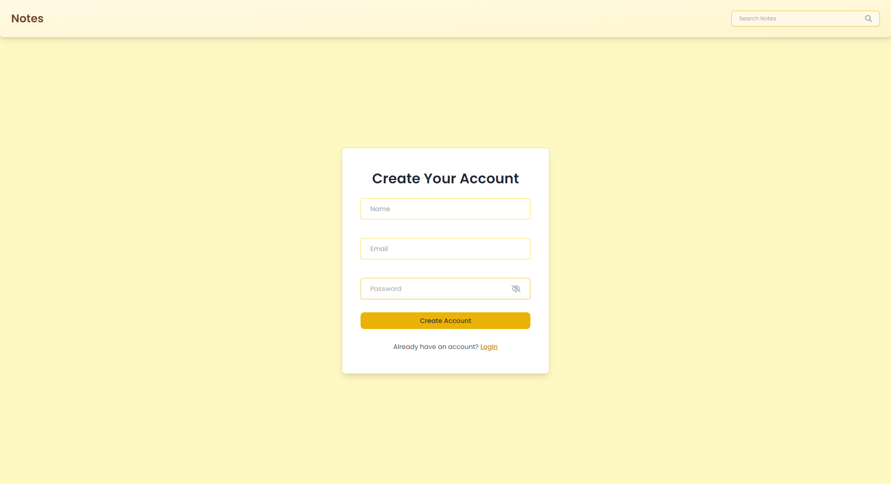
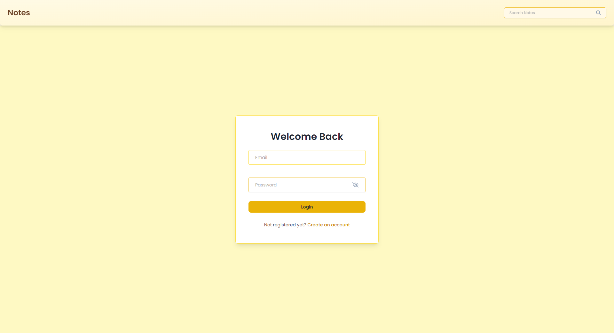
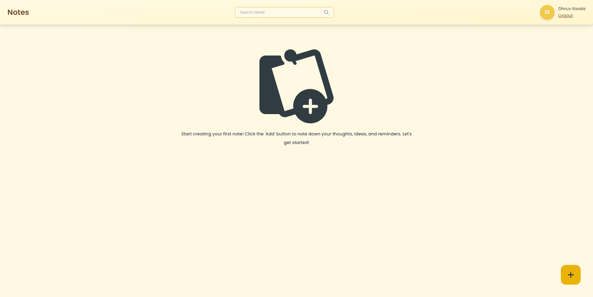
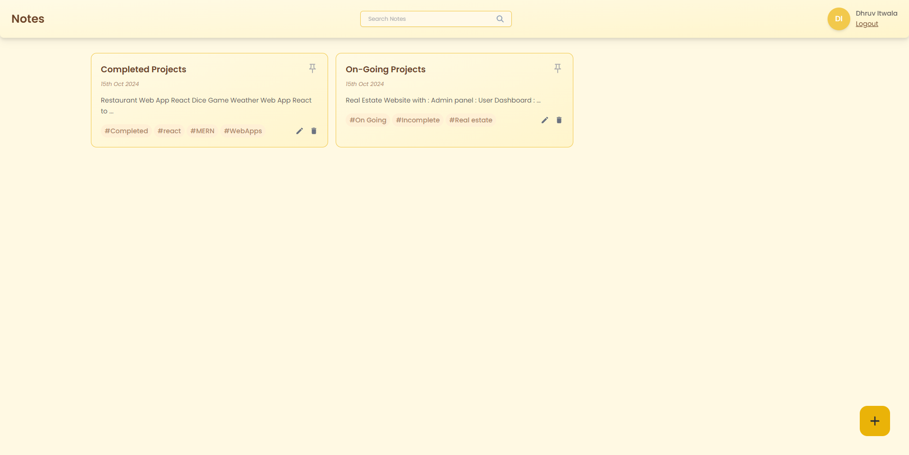
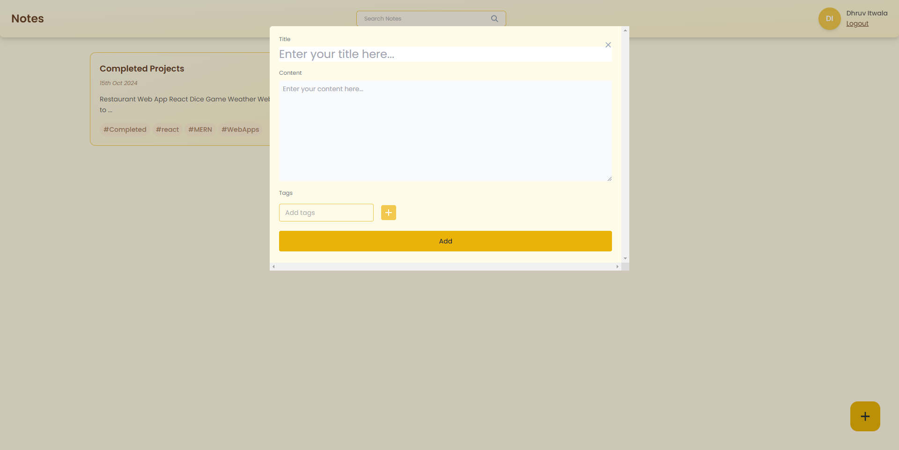
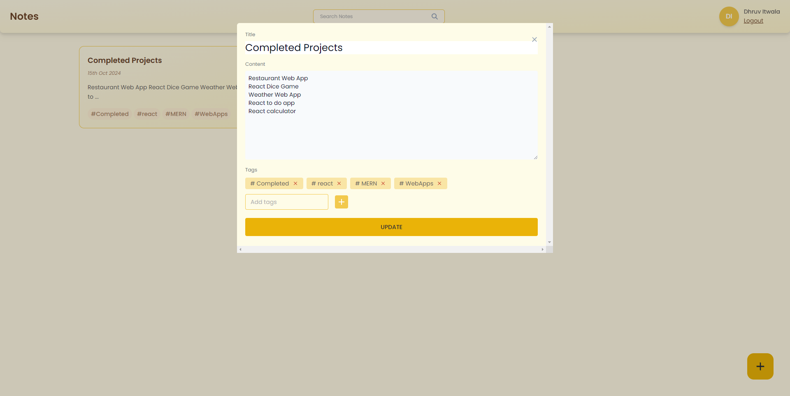

# Notes App

## Overview

The **Notes App** is a full-stack application built with the MERN stack (MongoDB, Express, React, Node.js). This application provides users with the ability to create, edit, and delete notes, and includes a user authentication feature via Auth0.

## Features

- User authentication and authorization using Auth0
- Create, edit, and delete notes
- Responsive design using Tailwind CSS
- Intuitive and user-friendly interface

## Technologies Used

- **Frontend:**

  - React
  - Vite
  - Tailwind CSS

- **Backend:**
  - Express.js
  - MongoDB

## Installation

1. Clone the repository to your local machine.
2. Navigate to the frontend and backend directories and install the required packages.
3. Set up your environment variables for MongoDB and Auth0.
4. Start the development servers for both frontend and backend.

## Usage

- Visit the application in your browser.
- Register for an account or log in with your credentials.
- Start creating, editing, and deleting notes.

## Screenshots

Here are some screenshots of the application:

1. **Login/Signup Panel**
   
   

2. **Notes Dashboard**
   
   

3. **Create Note**
   

4. **Edit Note**
   

## Contributing

If you'd like to contribute to the project, please fork the repository and create a pull request.

## License

This project is licensed under the MIT License. See the [LICENSE](LICENSE) file for details.

## Acknowledgements

- Special thanks to the creators of the MERN stack and Auth0 for making development easier and more accessible.
